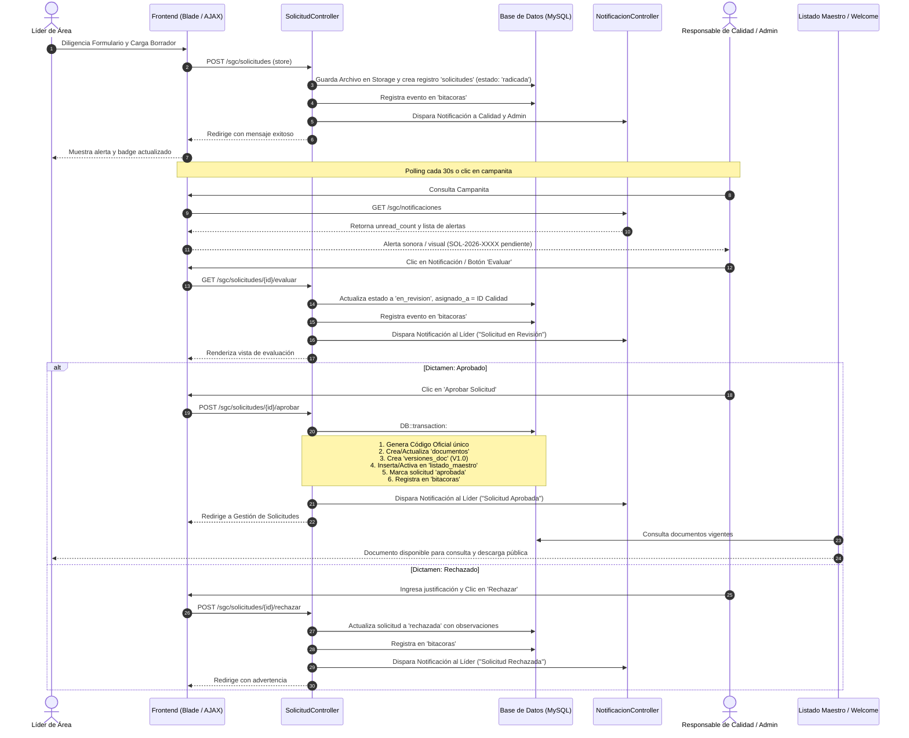
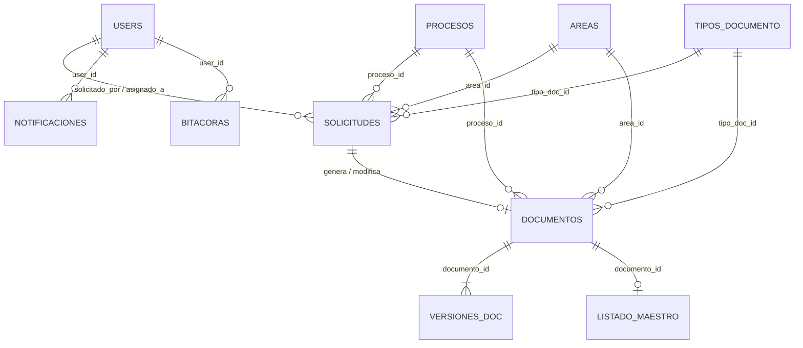

# 📖 Documentación Técnica: Flujo Documental, Notificaciones y Trazabilidad SGC

> **Sistema de Gestión de Calidad (SGC) • SENA Empresa CFA La Angostura**  
> *Módulo:* `Modules/SGC`  
> *Versión de Documentación:* 1.0  
> *Tecnologías:* Laravel 10+, MySQL / MariaDB, Blade, AdminLTE 3, Bootstrap 5, JavaScript (Fetch API).

---

## 📑 Tabla de Contenido
1. [Visión General del Flujo](#1-visión-general-del-flujo)
2. [Diagrama de Secuencia del Flujo](#2-diagrama-de-secuencia-del-flujo)
3. [Mapa Completo de Rutas (Routes)](#3-mapa-completo-de-rutas-routes)
4. [Controladores y Lógica de Negocio](#4-controladores-y-lógica-de-negocio)
   - [4.1 SolicitudController](#41-solicitudcontroller)
   - [4.2 NotificacionController](#42-notificacioncontroller)
   - [4.3 DocumentoController](#43-documentocontroller)
   - [4.4 TrazabilidadController](#44-trazabilidadcontroller)
5. [Modelos y Entidades de Base de Datos](#5-modelos-y-entidades-de-base-de-datos)
6. [Componentes de Interfaz de Usuario (UI / Blade)](#6-componentes-de-interfaz-de-usuario-ui--blade)
   - [6.1 Sidebars Dinámicos por Rol](#61-sidebars-dinámicos-por-rol)
   - [6.2 Campanita de Notificaciones en Tiempo Real](#62-campanita-de-notificaciones-en-tiempo-real)
   - [6.3 Paginación Estandarizada en Verde SENA](#63-paginación-estandarizada-en-verde-sena)
   - [6.4 Buscador Público del Listado Maestro (Welcome)](#64-buscador-público-del-listado-maestro-welcome)
7. [Guía de Estados y Transiciones](#7-guía-de-estados-y-transiciones)

---

## 1. Visión General del Flujo

El flujo documental del SGC gestiona de manera 100% transaccional y auditable el ciclo de vida de los documentos institucionales (formatos, guías, manuales, procedimientos, etc.), desde su solicitud inicial por parte de los Líderes de Área hasta su aprobación, codificación oficial y publicación pública en el Listado Maestro:

```
[ Líder de Área ] 
       │ (1. Radica Solicitud + Anexo)
       ▼
[ Base de Datos ] ──▶ [ Campanita Notificación ] ──▶ [ Responsable de Calidad / Admin ]
                                                             │
                                                             │ (2. Abre para Evaluar)
                                                             ▼
                                                    [ Estado: 'en_revision' ]
                                                             │
                                                             │ (Notifica al Líder)
                                                             ▼
                                                    ┌────────────────────────┐
                                                    │  Dictamen de Calidad   │
                                                    └──────────┬─────────────┘
                                           ┌───────────────────┴───────────────────┐
                                           ▼                                       ▼
                                    [ APROBADA ]                            [ RECHAZADA ]
                                           │                                       │
                         ┌─────────────────┴─────────────────┐                     │
                         ▼                                   ▼                     ▼
          1. Genera Código Oficial (PRO-PL-001)       1. Notifica al Líder  1. Registra Observaciones
          2. Inserta en 'documentos' (vigente)       2. Registra Bitácora  2. Notifica al Líder
          3. Crea Versión 'versiones_doc' (v1.0/v2.0)                      3. Registra Bitácora
          4. Publica en 'listado_maestro' (activo=1)
          5. Consulta Pública en Welcome y Buscador
```

---

## 2. Diagrama de Secuencia del Flujo



---

## 3. Mapa Completo de Rutas (Routes)

Todas las rutas del SGC están agrupadas bajo el prefijo `sgc` y el middleware de autenticación en [`Modules/SGC/Routes/web.php`](file:///c:/laragon/www/erpsenaempresacefa/Modules/SGC/Routes/web.php):

| Método HTTP | URI | Nombre de Ruta (`route()`) | Controlador & Método | Descripción del Propósito |
| :--- | :--- | :--- | :--- | :--- |
| `GET` | `/sgc` | `sgc.index` | `SGCController@index` | Portal público de bienvenida y buscador del Listado Maestro |
| `GET` | `/sgc/admin/dashboard` | `sgc.admin.dashboard` | `SGCController@adminDashboard` | Panel principal de administración con métricas |
| `GET` | `/sgc/lider-area/dashboard` | `sgc.lider_area.dashboard` | `SGCController@liderAreaDashboard` | Panel principal de gestión para Líderes de Área |
| `GET` | `/sgc/resp-calidad/dashboard` | `sgc.resp_calidad.dashboard` | `SGCController@respCalidadDashboard` | Panel principal para Responsable de Calidad |
| `GET` | `/sgc/solicitudes` | `sgc.solicitudes.index` | `SolicitudController@index` | Bandeja de solicitudes (vista dinámica según rol) |
| `POST` | `/sgc/solicitudes` | `sgc.solicitudes.store` | `SolicitudController@store` | Radicación de nueva solicitud con carga de anexo |
| `GET` | `/sgc/solicitudes/{id}/evaluar` | `sgc.solicitudes.evaluar` | `SolicitudController@evaluar` | Apertura de solicitud, cambio a `en_revision` y vista de dictamen |
| `POST` | `/sgc/solicitudes/{id}/aprobar` | `sgc.solicitudes.aprobar` | `SolicitudController@aprobar` | Aprobación, codificación, versionamiento y publicación |
| `POST` | `/sgc/solicitudes/{id}/rechazar` | `sgc.solicitudes.rechazar` | `SolicitudController@rechazar` | Rechazo con observaciones técnicas |
| `GET` | `/sgc/solicitudes/{id}` | `sgc.solicitudes.show` | `SolicitudController@show` | Detalle modal / consulta individual de la solicitud |
| `GET` | `/sgc/solicitudes/{id}/download-adjunto` | `sgc.solicitudes.download-adjunto` | `SolicitudController@downloadAdjunto` | Descarga segura del archivo borrador radicado |
| `GET` | `/sgc/lider-area/solicitudes` | `sgc.lider_area.solicitudes.index` | `SolicitudController@index` | Alias directo para el portal del Líder de Área |
| `POST` | `/sgc/lider-area/solicitudes` | `sgc.lider_area.solicitudes.store` | `SolicitudController@store` | Alias de radicación para el Líder de Área |
| `GET` | `/sgc/lider-area/solicitudes/{id}` | `sgc.lider_area.solicitudes.show` | `SolicitudController@show` | Alias de detalle para el Líder de Área |
| `GET` | `/sgc/lider-area/solicitudes/{id}/download-adjunto` | `sgc.lider_area.solicitudes.download-adjunto` | `SolicitudController@downloadAdjunto` | Alias de descarga de anexo para Líder |
| `GET` | `/sgc/documentos` | `sgc.documentos.index` | `DocumentoController@index` | Listado maestro y gestión de documentos con paginación verde |
| `GET` | `/sgc/documentos/{id}/download` | `sgc.documentos.download` | `DocumentoController@download` | Descarga de la versión oficial y vigente del documento |
| `GET` | `/sgc/documentos/{id}/modal-preview` | `sgc.documentos.modal-preview` | `DocumentoController@modalPreview` | Visualización rápida modal de metadatos y visor PDF |
| `GET` | `/sgc/trazabilidad` | `sgc.trazabilidad.index` | `TrazabilidadController@index` | Registro de bitácora y auditoría con filtros avanzados |
| `GET` | `/sgc/trazabilidad/export` | `sgc.trazabilidad.export` | `TrazabilidadController@export` | Exportación de bitácora a CSV compatible con Excel |
| `GET` | `/sgc/trazabilidad/{id}` | `sgc.trazabilidad.show` | `TrazabilidadController@show` | Detalle modal de auditoría y payload JSON |
| `GET` | `/sgc/notificaciones` | `sgc.notificaciones.index` | `NotificacionController@index` | Endpoint JSON con lista de alertas y contador `unread_count` |
| `POST` | `/sgc/notificaciones/{id}/leer` | `sgc.notificaciones.leer` | `NotificacionController@marcarLeida` | Marca una notificación específica como leída |
| `POST` | `/sgc/notificaciones/leer-todas` | `sgc.notificaciones.leer-todas` | `NotificacionController@marcarTodasLeidas` | Marca todas las notificaciones del usuario como leídas |
| `GET` | `/sgc/reportes` | `sgc.reportes.index` | `ReportesController@index` | Estadísticas, cumplimiento y documentos por vencer |
| `GET` | `/sgc/reportes/export/excel` | `sgc.reportes.export.excel` | `ReportesController@exportExcel` | Exportación analítica en formato Excel / CSV |

---

## 4. Controladores y Lógica de Negocio

### 4.1 SolicitudController
**Archivo:** [`Modules/SGC/Http/Controllers/SolicitudController.php`](file:///c:/laragon/www/erpsenaempresacefa/Modules/SGC/Http/Controllers/SolicitudController.php)

- **`index(Request $request)`:**
  Detecta automáticamente si la solicitud proviene de un Líder de Área (mediante `request()->routeIs('sgc.lider_area.*')` o comprobando su rol en BD). Si es Líder, carga `indexLiderArea()` con sus propias solicitudes, tarjetas de métricas (*Total Radicadas, En Trámite, Aprobadas, Rechazadas*) y el modal de radicación. Si es Administrador o Calidad, carga la bandeja centralizada con filtros por estado y buscador global.
- **`store(StoreSolicitudRequest $request)`:**
  1. Genera un número de radicado con formato `SOL-{AÑO}-{CORRELATIVO}` (ej. `SOL-2026-0001`).
  2. Guarda el anexo adjunto en `storage/app/public/sgc/solicitudes/` garantizando un nombre sanitizado.
  3. Crea el registro en la tabla `solicitudes` con `estado = 'radicada'`.
  4. Crea un registro en la tabla `bitacoras` (acción: `creacion`, detalle: *"Radicación de solicitud..."*).
  5. Busca a los usuarios con rol *Responsable de Calidad* y *Administrador* y les inserta una notificación en la tabla `notificaciones`.
- **`evaluar($id)`:**
  1. Localiza la solicitud por ID.
  2. Si su estado es `radicada`, realiza la transición automática a `en_revision`, asigna `asignado_a = auth()->id()` y registra el cambio en `bitacoras`.
  3. Notifica al Líder de Área solicitante: *"Su solicitud #SOL-... ha iniciado la fase de revisión técnica por Calidad"*.
  4. Renderiza la vista [`evaluar.blade.php`](file:///c:/laragon/www/erpsenaempresacefa/Modules/SGC/Resources/views/Resp_Calidad/Solicitudes/evaluar.blade.php).
- **`aprobar(Request $request, $id)`:**
  Ejecuta dentro de `DB::transaction()`:
  1. Si es creación de nuevo documento:
     - Genera el código oficial único tomando el prefijo del proceso, el prefijo del tipo de documento y el número correlativo (ej. `PRO-PL-001`).
     - Inserta el registro en `documentos` con `estado = 'vigente'`.
     - Crea la primera versión en `versiones_doc` (`version = '1.0'`, `archivo_ruta = ruta_del_adjunto`).
     - Inserta el registro en `listado_maestro` (`activo = 1`).
  2. Si es modificación de documento existente:
     - Localiza el documento original.
     - Incrementa la versión (ej. `2.0`).
     - Archiva las versiones anteriores como `obsoleta`.
     - Actualiza el registro en `documentos` y `listado_maestro`.
  3. Actualiza la solicitud a `estado = 'aprobada'`, `observaciones_calidad` y `fecha_resolucion = now()`.
  4. Inserta auditoría en `bitacoras`.
  5. Dispara notificación al Líder: *"Solicitud Aprobada y Documento Publicado en Listado Maestro"*.
- **`rechazar(Request $request, $id)`:**
  1. Valida las observaciones obligatorias de rechazo.
  2. Actualiza la solicitud a `estado = 'rechazada'`.
  3. Inserta auditoría en `bitacoras`.
  4. Dispara notificación al Líder con las observaciones técnicas.

---

### 4.2 NotificacionController
**Archivo:** [`Modules/SGC/Http/Controllers/NotificacionController.php`](file:///c:/laragon/www/erpsenaempresacefa/Modules/SGC/Http/Controllers/NotificacionController.php)

- **`index()`:**
  - Recupera las últimas 15 notificaciones dirigidas al usuario en sesión (`user_id = auth()->id()`).
  - Calcula el `unread_count` (notificaciones con `leida = 0`).
  - Formatea la fecha a formato relativo en español (ej. *Hace 3 min*, *Hace 1 hora*, *Ayer*).
  - Devuelve respuesta JSON consumida por el componente del Navbar.
- **`marcarLeida($id)`:**
  - Actualiza `leida = 1` para la notificación seleccionada.
- **`marcarTodasLeidas()`:**
  - Actualiza masivamente `leida = 1` para todas las alertas del usuario autenticado.

---

### 4.3 DocumentoController
**Archivo:** [`Modules/SGC/Http/Controllers/DocumentoController.php`](file:///c:/laragon/www/erpsenaempresacefa/Modules/SGC/Http/Controllers/DocumentoController.php)

- **`index(Request $request)`:**
  - Consulta los documentos aplicando filtros por proceso, área, tipo documental, estado y término de búsqueda.
  - Implementa paginación con `paginate(10)` vinculada al componente visual en Verde SENA.
- **`download($id)`:**
  - Valida la existencia física del archivo de la versión vigente en el disco `storage/` y fuerza la descarga con las cabeceras HTTP correctas (`Content-Type: application/pdf`, `Content-Disposition`).
- **`modalPreview($id)`:**
  - Retorna los metadatos completos y la ruta de visualización para renderizar el modal sin recargar la página.

---

### 4.4 TrazabilidadController
**Archivo:** [`Modules/SGC/Http/Controllers/TrazabilidadController.php`](file:///c:/laragon/www/erpsenaempresacefa/Modules/SGC/Http/Controllers/TrazabilidadController.php)

- **`index(Request $request)`:**
  - Lista todas las acciones de la tabla `bitacoras` (creación, edición, cambio de estado, aprobación, rechazo, descargas).
  - Incluye filtros por tipo de evento, usuario responsable y rango de fechas.
  - Paginado institucional con Verde SENA.
- **`export(Request $request)`:**
  - Genera un archivo `.csv` descargable con codificación UTF-8 BOM para apertura nativa y sin distorsión de caracteres en Microsoft Excel.

---

## 5. Modelos y Entidades de Base de Datos



1. **`Solicitud` (`Modules\SGC\Models\Solicitud`)**:
   Campos: `id`, `numero`, `tipo_solicitud` (*creacion, modificacion, eliminacion*), `proceso_id`, `area_id`, `tipo_doc_id`, `documento_id`, `nombre_propuesto`, `justificacion`, `archivo_adjunto`, `estado` (*radicada, en_revision, aprobada, rechazada*), `solicitado_por`, `asignado_a`, `fecha_radicacion`, `fecha_resolucion`, `observaciones_calidad`.
2. **`Documento` (`Modules\SGC\Models\Documento`)**:
   Campos: `id`, `codigo`, `nombre`, `proceso_id`, `area_id`, `tipo_doc_id`, `version_actual`, `estado` (*borrador, en_revision, vigente, obsoleto*), `creado_por`.
3. **`VersionDoc` (`Modules\SGC\Models\VersionDoc`)**:
   Campos: `id`, `documento_id`, `version`, `archivo_ruta`, `archivo_nombre_orig`, `descripcion_cambios`, `fecha_vigencia`, `estado` (*vigente, historico, obsoleto*), `creado_por`.
4. **`ListadoMaestro` (`Modules\SGC\Models\ListadoMaestro`)**:
   Campos: `id`, `documento_id`, `codigo`, `nombre`, `version`, `fecha_emision`, `proceso_id`, `area_id`, `tipo_doc_id`, `activo`.
5. **`Bitacora` (`Modules\SGC\Models\Bitacora`)**:
   Campos: `id`, `user_id`, `accion`, `modulo`, `tabla_afectada`, `registro_id`, `ip`, `user_agent`, `payload_previo`, `payload_nuevo`, `created_at`.
6. **`Notificacion` (`App\Models\Notificacion`)**:
   Campos: `id`, `user_id`, `titulo`, `mensaje`, `tipo`, `url`, `leida`, `created_at`.

---

## 6. Componentes de Interfaz de Usuario (UI / Blade)

### 6.1 Sidebars Dinámicos por Rol
El layout maestro [`Modules/SGC/Resources/views/layouts/master.blade.php`](file:///c:/laragon/www/erpsenaempresacefa/Modules/SGC/Resources/views/layouts/master.blade.php) evalúa el rol del usuario e incluye el sidebar correspondiente:

- **Sidebar Admin (`SidebarAdmin.blade.php`):**
  Incluye el ítem **"Solicitudes"** (`route('sgc.solicitudes.index')`) con icono `fas fa-file-circle-check` y badge numérico de alertas pendientes:
  ```blade
  @php
      $adminPendingSolicitudes = \Modules\SGC\Models\Solicitud::whereIn('estado', ['radicada', 'en_revision'])->count();
  @endphp
  <a href="{{ route('sgc.solicitudes.index') }}" class="nav-link ...">
      <i class="nav-icon fas fa-file-circle-check"></i>
      <p>Solicitudes</p>
      @if($adminPendingSolicitudes > 0)
          <span class="badge rounded-pill bg-warning text-dark">{{ $adminPendingSolicitudes }}</span>
      @endif
  </a>
  ```
- **Sidebar Líder de Área (`SidebarLider.blade.php`):**
  Incluye el ítem **"Solicitudes"** (`route('sgc.lider_area.solicitudes.index')`) con badge que cuenta únicamente las solicitudes en trámite radicadas por el líder en sesión (`solicitado_por = auth()->id()`).
- **Sidebar Responsable de Calidad (`SidebarRespCalidad.blade.php`):**
  Muestra el menú con acceso directo a la evaluación y dictamen de calidad.

### 6.2 Campanita de Notificaciones en Tiempo Real
Ubicada en [`NavbarAdmin.blade.php`](file:///c:/laragon/www/erpsenaempresacefa/Modules/SGC/Resources/views/layouts/NavbarAdmin.blade.php):
- **Badge Animado:** Muestra el número de notificaciones no leídas (`#notif-badge-count`).
- **Dropdown List:** Renderiza la lista con iconos temáticos y enlace interactivo.
- **Acción al Clic:** Llama a la función JavaScript `clickNotificacion(id, url)` que envía una petición `POST` al endpoint `/sgc/notificaciones/{id}/leer` mediante `fetch()` con token CSRF y redirige al usuario a la URL de destino de inmediato.
- **Polling Automático:** Ejecuta `setInterval(cargarNotificaciones, 30000)` para refrescar alertas en segundo plano cada 30 segundos.

### 6.3 Paginación Estandarizada en Verde SENA
- **Plantilla Parcial:** [`Modules/SGC/Resources/views/layouts/partials/pagination.blade.php`](file:///c:/laragon/www/erpsenaempresacefa/Modules/SGC/Resources/views/layouts/partials/pagination.blade.php)
- **Vendor Override:** [`resources/views/vendor/pagination/bootstrap-5.blade.php`](file:///c:/laragon/www/erpsenaempresacefa/resources/views/vendor/pagination/bootstrap-5.blade.php)
- **Paleta Institucional:**
  - Activo: Gradiente `#39A900` a `#2e8b00`, texto blanco, sombra `0 3px 8px rgba(57, 169, 0, 0.35)`.
  - Hover: Fondo suave `#eaf8ea`, texto `#007832`, borde `#39A900`.
  - Chevrons: Íconos FontAwesome `<i class="fas fa-chevron-left"></i>` y `<i class="fas fa-chevron-right"></i>`.
  - Sin textos duplicados en inglés: Removido el contenedor nativo *"Showing X to Y of Z results"*.

### 6.4 Buscador Público del Listado Maestro (Welcome)
Ubicado en [`welcome.blade.php`](file:///c:/laragon/www/erpsenaempresacefa/Modules/SGC/Resources/views/welcome.blade.php):
- **Búsqueda en Vivo:** Campo de texto dinámico que filtra documentos por código institucional o título sin recargar la página.
- **Selector de Procesos:** Filtro desplegable por categoría o proceso.
- **Paginación Cliente (8 items por página):** Con botones de páginas verdes e indicador *"Mostrando X - Y de Z documentos"*.
- **Previsualización y Descargas:** Modal integrado para consultar información del documento y botón de descarga directa del PDF.

---

## 7. Guía de Estados y Transiciones

| Estado | Color Badge | Descripción y Significado | Quién lo Transiciona |
| :--- | :--- | :--- | :--- |
| `radicada` | <span style="background-color:#e0f2fe; color:#0369a1; padding:2px 8px; border-radius:12px; font-weight:bold;">Radicada</span> | Solicitud recién creada por el Líder con borrador adjunto. | Líder de Área al enviar formulario |
| `en_revision` | <span style="background-color:#fef9c3; color:#a16207; padding:2px 8px; border-radius:12px; font-weight:bold;">En revisión</span> | Solicitud abierta por Calidad; se encuentra en estudio técnico. | Automático al abrir `evaluar()` |
| `aprobada` | <span style="background-color:#dcfce7; color:#15803d; padding:2px 8px; border-radius:12px; font-weight:bold;">Aprobada</span> | Dictamen favorable; documento codificado y publicado en Listado Maestro. | Responsable de Calidad / Admin |
| `rechazada` | <span style="background-color:#fee2e2; color:#b91c1c; padding:2px 8px; border-radius:12px; font-weight:bold;">Rechazada</span> | Dictamen no favorable con observaciones técnicas obligatorias. | Responsable de Calidad / Admin |

---

> **Fin de la Documentación Técnica**  
> Para soporte o modificaciones adicionales, contacte al equipo de desarrollo de SENA Empresa CFA La Angostura.
